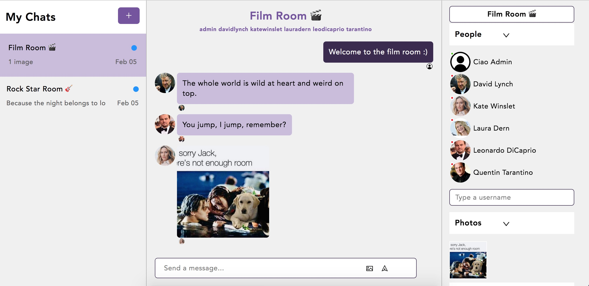

# Ciao - React Chat App
This is a Microsoft Teams clone built with React JS and Chat Engine.  
It was built following JavaScript Mastery's step-by-step YouTube tutorial: https://youtu.be/jcOKU9f86XE

My goal with this project was to learn how to think in React, get familiar with React concepts and practice writing JSX.

Live Site URL: https://ciao-chatapp.netlify.app  
Username: admin  
Password: 123123

## Built with
- HTML & CSS
- React
- JSX

## Acknowledgements
JavaScript Mastery: https://youtu.be/jcOKU9f86XE  
Backend hosted by https://chatengine.io  
Components made by https://www.npmjs.com/package/react-chat-engine  
Styles by https://gist.github.com/adrianhajdin/c3a3195dd091359f3402a572961abb98
