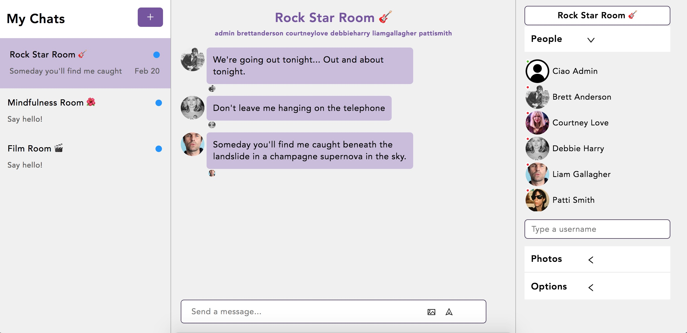

# Ciao - React Chat App
This is a Microsoft Teams clone built with React JS and Chat Engine. 
It was built step-by-step following JavaScript Mastery YouTube tutorial: https://youtu.be/jcOKU9f86XE

The goal of this project was to learn how to think in React, get familiar with React concepts and practice writing JSX.

Live Site URL: https://ciaochatapp.netlify.app. 
Username: admin. 
Password: 123123

## Built with
- HTML & CSS
- React
- JSX

## Acknowledgements
JavaScript Mastery: https://youtu.be/jcOKU9f86XE
Backend hosted by https://chatengine.io
Components made by https://www.npmjs.com/package/react-chat-engine
Styles by https://gist.github.com/adrianhajdin/c3a3195dd091359f3402a572961abb98
